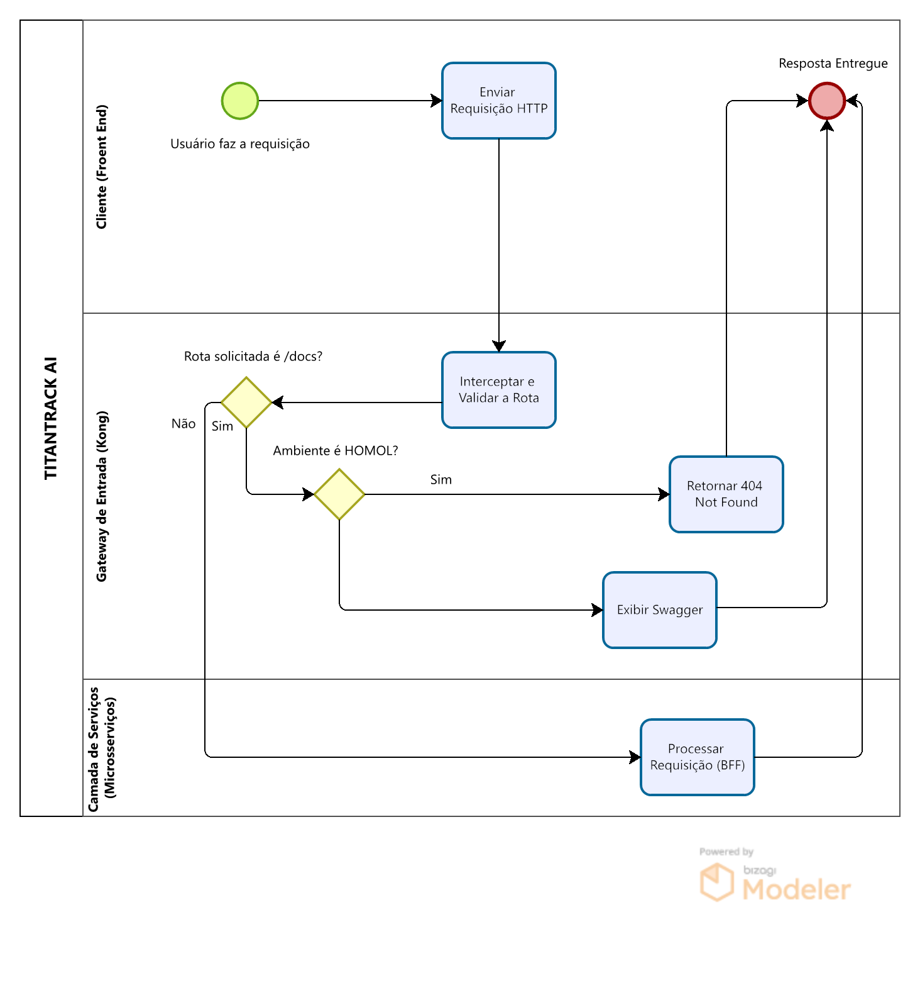

# 🚀 TitanTrack BFF — Core Application & Business Logic Service

Bem-vindo ao repositório do **TitanTrack BFF (Backend-for-Frontend)**.

Este serviço concentra as regras de negócio, autenticação e gerenciamento de dados do ecossistema TitanTrack. Desenvolvido em **Python + FastAPI**, ele opera como um microsserviço independente integrado à arquitetura baseada em API Gateway.

---

# 🏗️ Responsabilidades do Serviço

Dentro da arquitetura do TitanTrack, este microsserviço é responsável por:

- Processamento das regras de negócio;
- Autenticação e autorização de usuários;
- Gerenciamento de dados acadêmicos;
- Persistência de dados em banco relacional;
- Exposição de APIs REST consumidas pelos clientes.

---

# 🗺️ Fluxo de Processamento

O fluxo operacional foi modelado utilizando o Bizagi Modeler:



## Papel do BFF

1. A requisição chega ao **Kong API Gateway**.
2. O Gateway valida e encaminha o tráfego.
3. A requisição é direcionada para o microsserviço correspondente.
4. O **TitanTrack BFF** executa:
   - validações;
   - regras de negócio;
   - operações de persistência.
5. A resposta é retornada ao cliente através do Gateway.

---

# 🌐 Endpoints

## Autenticação

```http
POST /api/auth
```

Responsável pela validação de credenciais e emissão de tokens.

## Gerenciamento de Alunos

```http
GET /api/aluno
POST /api/aluno
```

Responsável pelo cadastro, consulta e gerenciamento de alunos.

## Documentação

```http
GET /docs
```

Interface Swagger/OpenAPI disponibilizada pelo FastAPI.

---

# 🛡️ Ambientes

| Recurso | Desenvolvimento | Homologação |
|----------|----------|----------|
| URL | `titantrack-bfff-dev.onrender.com` | `titantrack-bfff-homol.onrender.com` |
| Swagger | Disponível | Restrito/Bloqueado |
| Banco de Dados | Ambiente de testes | Ambiente de homologação |

---

# 🚀 Pipeline CI/CD

O projeto utiliza **GitHub Actions** para integração e entrega contínua.

```text
Push / Pull Request
        ↓
 Instalação do Ambiente
        ↓
      Testes
        ↓
    SonarCloud
        ↓
      Deploy
```

## Continuous Integration (CI)

A cada Push ou Pull Request:

- Execução dos testes automatizados com Pytest;
- Execução dos testes E2E utilizando Selenium;
- Análise estática de código com SonarCloud;
- Verificação dos critérios de qualidade definidos pelo projeto.

## Continuous Deployment (CD)

### Branch `develop`

Deploy automático para ambiente de desenvolvimento.

### Branch `master`

Deploy automático para ambiente de homologação.

---

# 📊 Observabilidade

O monitoramento da aplicação é realizado através do ecossistema Grafana Cloud.

As métricas coletadas permitem acompanhar:

- Tempo de resposta;
- Latência das requisições;
- Disponibilidade dos serviços;
- Comportamento da infraestrutura.

---

# 🛠️ Execução Local

## Pré-requisitos

- Python 3.10+
- Virtual Environment (venv)

## Clonando o Projeto

```bash
git clone <repositorio>
cd bff-service
```

## Criando o Ambiente Virtual

### Windows

```bash
python -m venv venv
venv\Scripts\activate
```

### Linux / macOS

```bash
python -m venv venv
source venv/bin/activate
```

## Instalando Dependências

```bash
pip install -r requirements.txt
```

## Executando a Aplicação

```bash
uvicorn app.main:app --reload --port 8000
```

A aplicação ficará disponível em:

```text
http://localhost:8000
```

Documentação Swagger:

```text
http://localhost:8000/docs
```

---

# 🧪 Testes de API

## Autenticação

**Método**

```http
POST /api/auth
```

**URL**

```text
https://titantrack-wgv3.onrender.com/api/auth
```

## Consulta de Alunos

**Método**

```http
GET /api/aluno
```

**URL**

```text
https://titantrack-wgv3.onrender.com/api/aluno
```

**Resposta Esperada**

```http
200 OK
```

Retorno contendo os registros cadastrados no sistema.

---

# 📚 Tecnologias Utilizadas

- Python
- FastAPI
- Uvicorn
- Pytest
- Selenium
- GitHub Actions
- SonarCloud
- Kong API Gateway
- Grafana Cloud
- Render